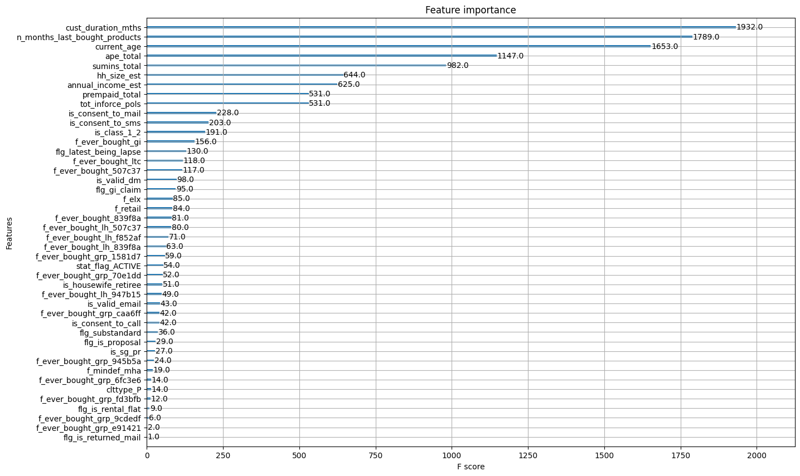
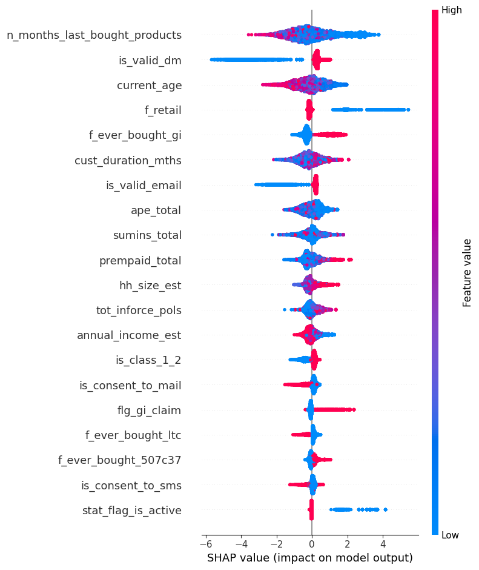

# NUS SDS Datathon 2024 

Image generated by author via DALL-E.

## Project Overview
This is a data analysis and predictive modeling project involving a binary classification task. The client is a well-known insurance company. The objectives of this project were to predict the insurance company's customer conversion rate, identify key drivers that contribute to customer churn (non-conversion), and propose recommendations based on our insights.

This is a short write-up summary of the project and more detailed output and visualisations can be found within the [notebook](./nus_datathon_submission.ipynb). Our analysis and model emerged 2nd runners-up in the Datathon!

## Data Sources
Unfortunately, due to the confidential nature of insurance data, an NDA is in force and I am unable to access or share the dataset used for this project. Additionally, all cell outputs have been removed to prevent inadvertent leakage of confidential data.

## Project Workflow
The analysis process consisted of:
1. Dataset exploration and cleaning
2. Feature engineering
3. Model building
4. Model interpretation

## 1. Dataset Exploration and Cleaning
This step mainly involved examining the level of missingness present within the dataset, balancing the dataset, and excluding features or observations based on redundancy. 

For example, we dropped features with >50% missingness, or only had one unique value. We also dropped observations that were missing across many features. We dropped observations that had missing data for features that were problematic to impute from a statistical standpoint (e.g. sex and country), although this was fortunately a minority. We also dropped race from our analysis due to the socioethical implications of recommending different (and discriminatory) marketing strategies based on a customer's race.

At this point, we found that the dataset was severely imbalanced, with <5% in the minority (positive) class. We attempted to use an ensemble approach (BalancedBaggingClassifier), as well as class weights, to avoid having to lose samples via downsampling. However, the precision of our resultant models were abysmal (<0.3). Ultimately, we employed a hybrid balancing approach, where we took a 25% downsample of the majority class, and upsampled the minority class to match this number. The eventual balanced dataset was about half the size of the original dataset. 

We also made use of the `tableone` package to summarise the descriptive statistics of all remaining features grouped by class, and dropped features which did not have any statistically significant difference between both classes (p-value > 0.05). Of course, this was done on the balanced dataset for comparability.

## 2. Feature Engineering
One of the main steps in this stage was to label encode the ordinal categorical variables present (household size and annual income). Instead of one-hot encoding the nominal categorical variables, simple descriptive analyses revealed that for the nominal variables present, one category tended to be the majority. For example, for the `country` feature, although there were more than 10 countries in the list of unique values, majority of the customers were Singaporean. Thus, we transformed this into a binary `ctry_is_sg` variable. 

Missing data imputation was another key step in this stage. We imputed household size and annual income, which were ordinal categorical variables with 5 buckets each. We performed k-Nearest Neighbours imputation, where k = 5. A cursory glance at the imputed data (not included in the submission notebook) revealed that most of the imputed data fell into the most common bucket, thus indicating that mode imputation would likely have been sufficient.

Other feature engineering steps included converting date variables into a meaningful numerical feature - for example, `date_of_birth` was converted into `current_age`. 

Although not feature engineering per se, but more of feature selection, we also used a correlation matrix to remove features with high multicollinearity with other features. One example is stated in the notebook. However, we faced challenges in determining which features to exclude due to our lack of domain expertise. We chose not to employ PCA to further reduce the dimensionality of our data as we wanted to keep our model features interpretable.

Eventually, we reduced the dimensionality of the data from 303 features to just 45. 

## Model Building
We used the XGBoost classifier due to its good performance across a wide variety of use cases, as well as its general speed. We fine-tuned the hyperparameters using gridsearch cross-validation, and selected the best-performing model based on its precision. 

Although precision and recall were the main metrics stated in the judging criteria, we did not use the F1 score as that implies that precision and recall both have equal weightage/ importance in the model. However, we propose that for this specific application and our client's specific business objectives, precision is more important than recall. We want to minimise false positives (the model predicts that someone is going to buy a policy, but the person does not), while false negatives (the model predicts that someone is NOT going to buy a policy, but the person ends up doing so) are thus arguably less important. Hence, we used precision as our main metric for hyperparameter tuning. In hindsight, we probably should have used the F-beta score, assigning beta a value of <1, which will give more weight to precision while not completely excluding recall.

## Model Interpretation
We interpreted our model's feature importance using the `plot_importance` function in the XGBoost library. 

While this nicely shows the magnitude of importance of each feature in the model, it lacks directionality and does not inform recommendations based on these features. For example, `current_age` is the 3rd most important feature here, but does this mean that older clients are less likely or more likely to buy a policy? 

To derive clearer insights from our model, we used a SHAP beeswarm plot which shows both the magnitude and direction of importance for each feature. 

For example, we can see that higher values of `current_age` have a negative impact on the model's eventual output. This implies that older clients are less likely to buy a policy, and thus should be one of the points of focus for future marketing strategies. The notebook contains a few other insights and recommendations that I will not rehash here. 

## Concluding Thoughts

One important caveat of our analysis is that correlation does not imply causation! As with most other statistical predictive models out there, feature importance reveals the correlation between the feature and the label, and we do not know if there are additional unmeasured confounders that may have a causative effect on the feature and label. Thus, it is unwise to blindly make causal conclusions based on the model. Thus, one way to build upon this project is to identify causal relationships between features and outcome via causal inference methods and causal ML.

In conclusion, this project has been a great learning experience in dealing with real-world data, especially messy and imbalanced datasets. 

## Acknowledgments 
This project was jointly contributed by my teammate, Zach, and myself. Also, a big thank you to the NUS Statistics and Data Science society for organising this datathon!

## License
This project is licensed under the [MIT License](LICENSE.md). You are free to use the code and resources for educational or personal purposes.

## Contact
Please feel free to contact me regarding any questions or feedback regarding this project. I can be reached at ongcrong@yahoo.com. 

Thank you for taking the time to look at this project!
